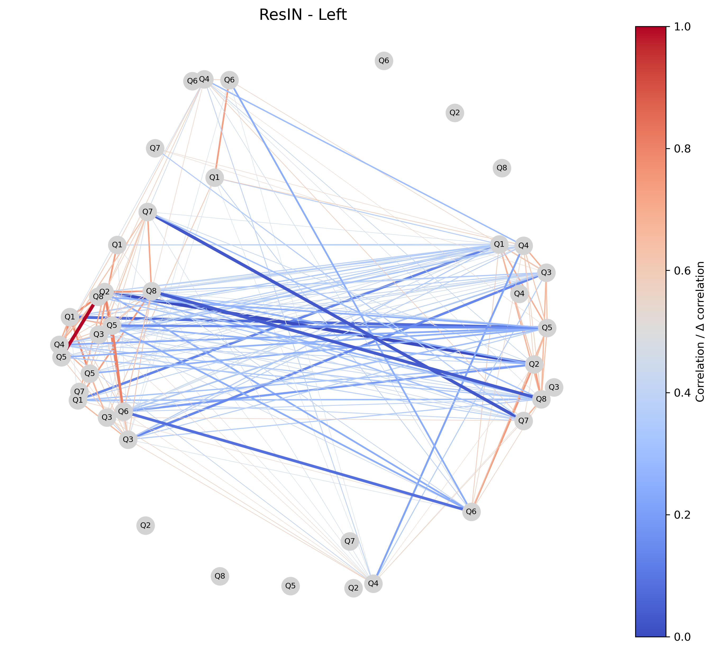
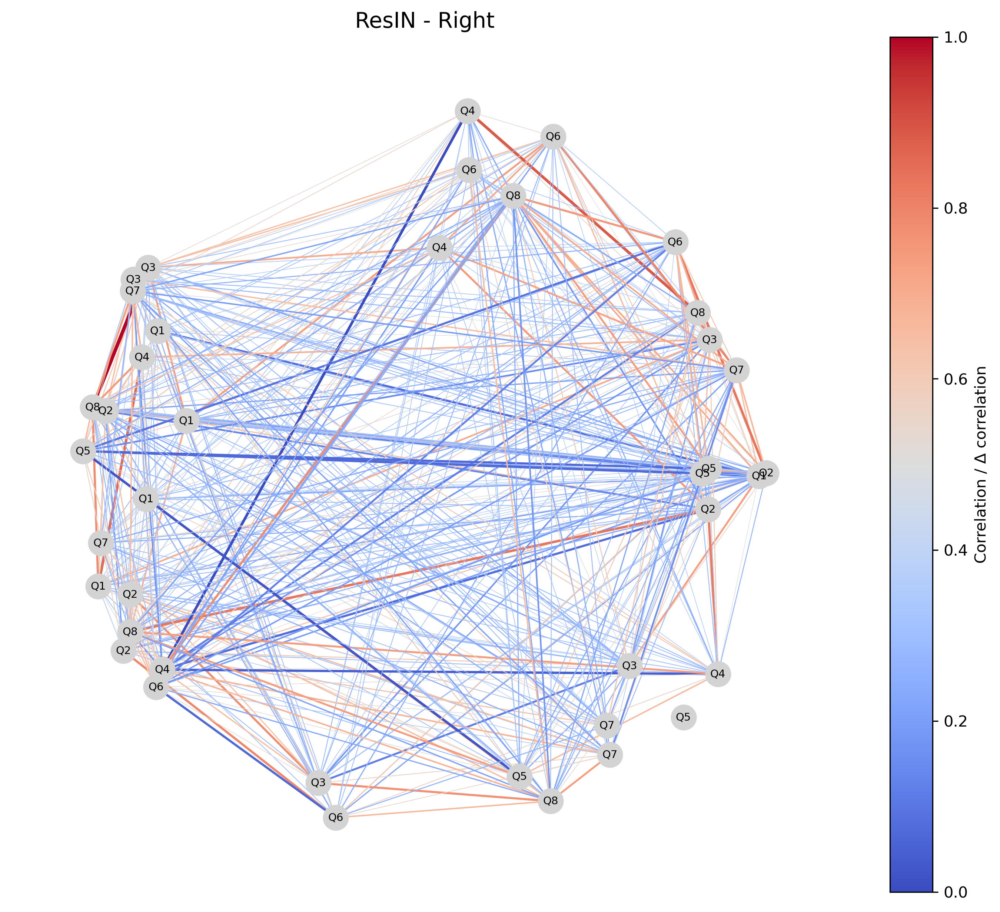
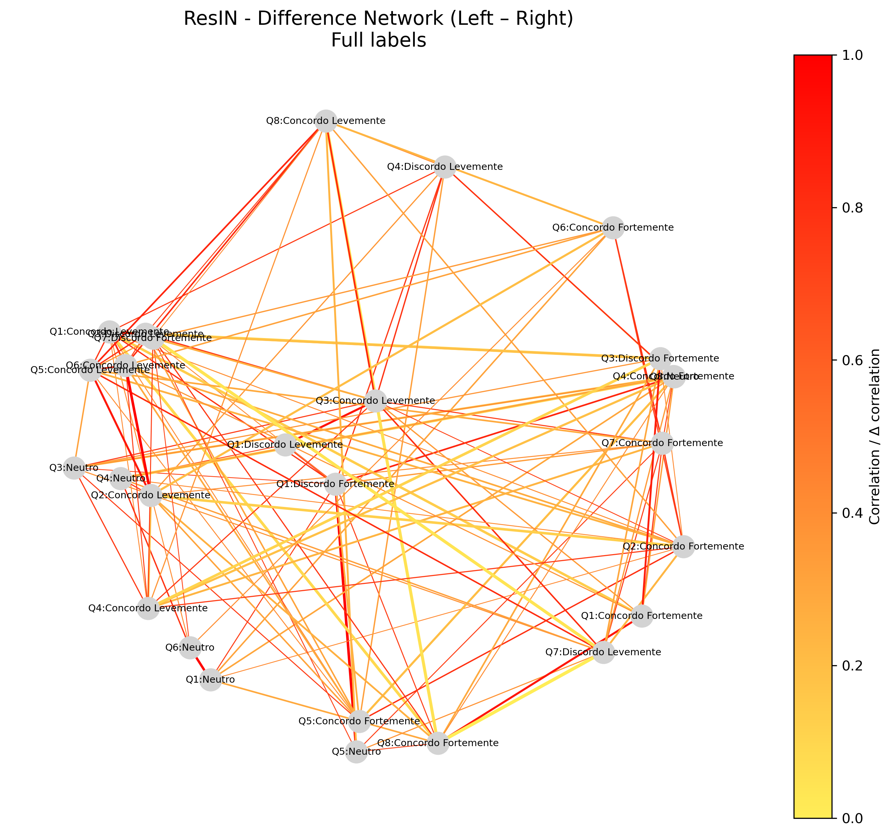
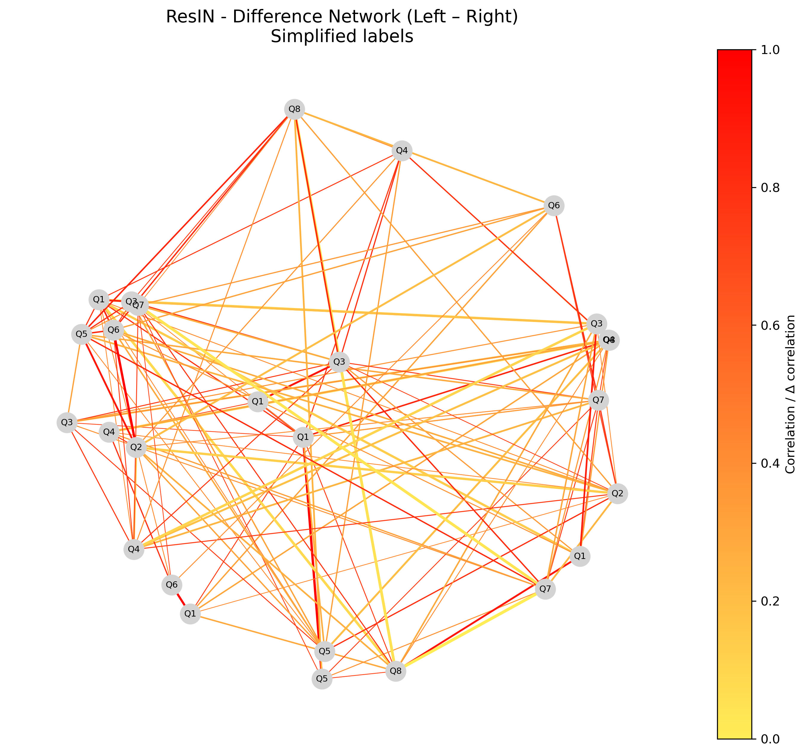
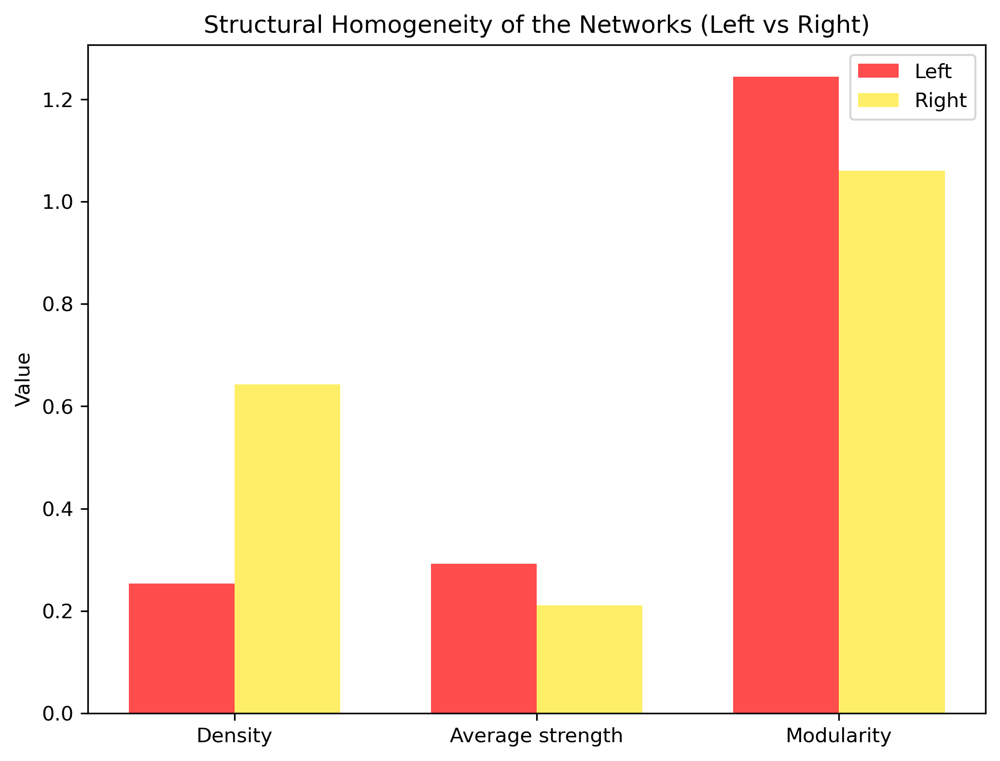

# 🇧🇷 Political Attitude Networks in Brazil using ResIN

This repository applies the **Response Item Network (ResIN)** method to Brazilian political survey data (*Política Brasil.csv*). Inspired by recent advances in **network psychometrics** and attitude systems, the analysis compares respondents who identify with the **Left** and the **Right**.  

The project builds upon methodological work such as:  

- Jonas Dalege et al. (2017). *The attitude network approach to attitudes: The structure of interconnections predicts attitude strength.* *Nature Human Behaviour.*  
- Stelling et al. (2024). *Response Item Network (ResIN): A novel method to study the internal structure of responses.* *Humanities and Social Sciences Communications.* [[Nature link]](https://www.nature.com/articles/s41599-024-03037-x)  

---

## 📊 Methodology

1. **ResIN networks** are built for Left and Right respondents.  
   - Nodes represent question–response pairs.  
   - Edges represent co-endorsement (correlation between binary response patterns).  
2. A **difference network** (Δ Left – Right) highlights divergences between groups.  
   - Red = stronger associations among the Left.  
   - Yellow = stronger associations among the Right.  
3. **Homogeneity metrics** (density, average edge strength, modularity) quantify the degree of internal coherence within each group.  

---

# 🧠 Explanation of Graphs

### **Graph 1 – ResIN (Left)**

This network depicts the attitudinal structure of respondents who identify with the **Left**. Each node is a survey response (Q1, Q2, …), and edges show how often two responses co-occur. Stronger co-endorsements appear as thicker edges.  

  

*Interpretation*: The Left shows **selective cohesion**. Redistribution and minority rights cluster strongly, while other issues form looser connections.  

---

### **Graph 2 – ResIN (Right)**

The corresponding network for respondents who identify with the **Right** shows a denser, more evenly distributed structure.  

  

*Interpretation*: The Right exhibits **more diffuse but stable coherence**, with issues like immigration, firearms, and economic policy binding attitudes more consistently together.  

---

### **Graph 3 – Difference Network (Δ Left – Right)**

This visualization isolates the **fault lines of polarization**.  

- **Red edges**: associations stronger within the Left (e.g., redistribution + minority rights).  
- **Yellow edges**: associations stronger within the Right (e.g., immigration + firearms).  
- Two versions are displayed: **full labels** (Qn:Response) and **simplified labels** (Qn only).  

**Full labels version:**  
  

**Simplified labels version:**  
  

*Interpretation*: Polarization is not only about endorsing different positions, but about **different ways of connecting beliefs**. The Left fuses equality-related issues, while the Right couples cultural and security concerns.  

---

### **Graph 4 – Homogeneity Comparison**

This bar chart compares Left and Right networks across three metrics:  

- **Density** → more realized associations.  
- **Average strength** → stronger ties overall.  
- **Modularity** → degree of fragmentation into clusters.  

  

*Interpretation*: The Right is **more homogeneous**, with higher density and integration. The Left shows **greater internal differentiation**, forming modular clusters of coherence.  

---

# 🌍 Broader Meaning

These results suggest that polarization in Brazil is not limited to disagreement over single issues. Instead, Left and Right differ in how their beliefs are **structured internally**.  

- The **Left** forms intense but modular clusters centered on equality and inclusion.  
- The **Right** exhibits a denser, less fragmented system, where cultural and security issues are tightly bound together.  

This asymmetry helps explain how each camp mobilizes and negotiates internal diversity: the Left allows more pluralism within its structure, while the Right is unified by a broader ideological frame.  

---

## ⚙️ Installation

Clone the repository and install dependencies:

```bash
git clone https://github.com/your-username/your-repo-name.git
cd your-repo-name
pip install -r requirements.txt


---

## ▶️ Usage

The full analysis is contained in the Jupyter notebook **`network.ipynb`**.

1. Make sure you have **Jupyter** installed (via `pip install jupyterlab` or `conda install jupyterlab`).

2. Launch the notebook environment:

   ```bash
   jupyter notebook network.ipynb
   ```

3. Open the notebook in your browser, execute the cells step by step, and the following outputs will be generated automatically:

   * **ResIN - Left** (`resin_left.png`)
   * **ResIN - Right** (`resin_right.png`)
   * **Difference Network (full labels)** (`resin_diff_full.png`)
   * **Difference Network (simplified labels)** (`resin_diff_simple.png`)
   * **Homogeneity comparison bar chart** (`resin_homogeneity.png`)

The notebook also prints the **reference map** linking question codes (Q1, Q2, …) to the original Portuguese survey questions and their English translations.

---

## 📝 Survey Questions

Below is the reference map of the survey items used in the networks.

| Code | Portuguese                                                                                                                | English Translation                                                                                                               |
| ---- | ------------------------------------------------------------------------------------------------------------------------- | --------------------------------------------------------------------------------------------------------------------------------- |
| Q1   | O aborto deve ser legal.                                                                                                  | Abortion should be legal.                                                                                                         |
| Q2   | O governo deve tomar medidas para reduzir a desigualdade de renda.                                                        | The government should take measures to reduce income inequality.                                                                  |
| Q3   | Todos os imigrantes em situação irregular devem ser enviados de volta ao seu país de origem.                              | All undocumented immigrants should be sent back to their home country.                                                            |
| Q4   | O orçamento federal destinado a programas sociais (como Bolsa Família e afins) deve ser aumentado.                        | The federal budget for social programs (such as Bolsa Família) should be increased.                                               |
| Q5   | Casais lésbicos, gays e trans devem ter o direito de se casar legalmente.                                                 | Lesbian, gay and trans couples should have the right to legally marry.                                                            |
| Q6   | O governo deve regulamentar as empresas para proteger o meio ambiente.                                                    | The government should regulate companies to protect the environment.                                                              |
| Q7   | O governo federal deve tornar mais fácil a compra de armas de fogo.                                                       | The federal government should make it easier to buy firearms.                                                                     |
| Q8   | O governo deve fazer um esforço concentrado para melhorar as condições sociais e econômicas da população negra no Brasil. | The government should make a concentrated effort to improve the social and economic conditions of the Black population in Brazil. |

---

## 📖 References

* Dalege, J., Borsboom, D., van Harreveld, F., & van der Maas, H. L. J. (2017). *The attitude network approach to attitudes: The structure of interconnections predicts attitude strength.* *Nature Human Behaviour*, 1, 0001.
* Stelling, K., et al. (2024). *Response Item Network (ResIN): A novel method to study the internal structure of responses.* *Humanities and Social Sciences Communications.* [https://www.nature.com/articles/s41599-024-03037-x](https://www.nature.com/articles/s41599-024-03037-x)

```

