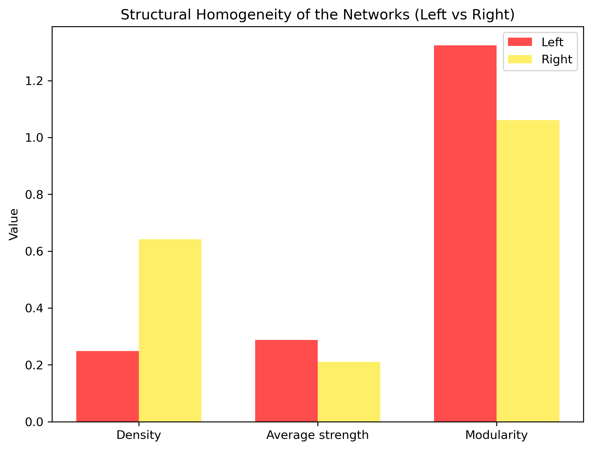

# 🇧🇷 Political Attitude Networks in Brazil using ResIN
# 🇧🇷 Political Attitude Networks in Brazil using ResIN

This repository applies the **Response Item Network (ResIN)** method to Brazilian political survey data (*Política Brasil.csv*). The analysis compares respondents who identify with the **Left** and the **Right**, mapping how their political attitudes interconnect into coherent ideological structures.  

The approach builds on recent work in **network psychometrics and attitude systems**, particularly:  

- Lüders, A., Carpentras, D., & Quayle, M. (2023). *Attitude networks as intergroup realities: Using network-modelling to research attitude–identity relationships in polarized political contexts.* *British Journal of Social Psychology*, 61(4), 1338–1356. [https://doi.org/10.1111/bjso.12665](https://doi.org/10.1111/bjso.12665)  
- Carpentras, D., Lüders, A., & Quayle, M. (2024). *Response Item Network (ResIN): A network-based approach to explore attitude systems.* *Humanities and Social Sciences Communications*, 11, 632. [https://www.nature.com/articles/s41599-024-03037-x](https://www.nature.com/articles/s41599-024-03037-x)  

---

## 📊 Methodology

1. **ResIN networks** were constructed separately for Left and Right respondents.  
   - **Nodes** = response options (e.g., Q1: Concordo, Q1: Discordo).  
   - **Edges** = co-endorsement, i.e., the correlation between binary response vectors.  
2. A **difference network** (Δ Left – Right) highlights divergences in association strength.  
   - **Red edges** = stronger within the Left.  
   - **Yellow edges** = stronger within the Right.  
3. **Homogeneity metrics** (density, average strength, modularity) quantify the structural organization of each group.  

---

# 🧠 Graphical Results

### **Graph 1 – ResIN (Left)**  
  

The Left network shows **cohesive clusters** around redistribution, social programs, minority rights, and environmental regulation. While certain clusters are strongly interconnected, the overall structure retains **subgroups and fragmentation**, indicating ideological diversity within the Left.  

---

### **Graph 2 – ResIN (Right)**  
  

The Right network displays a **denser and more unified structure**, with broad connectivity across immigration, firearms, and attitudes toward government regulation. The network suggests a **higher degree of internal coherence**, with fewer isolated clusters compared to the Left.  

---

### **Graph 3 – Difference Network (Δ Left – Right)**  

**Full labels version:**  
  

**Simplified labels version:**  
  

This network captures the **fault lines of polarization**.  
- **Red edges** highlight associations stronger among the Left (e.g., redistribution linked with minority rights and welfare expansion).  
- **Yellow edges** highlight associations stronger among the Right (e.g., immigration paired with firearm policy).  

The structural divergence indicates that Left and Right not only disagree on policy outcomes but also organize their **belief systems differently**.  

---

### **Graph 4 – Homogeneity Comparison**  
  

Three network-level measures provide a quantitative comparison:  
- **Density**: Higher for the Right, reflecting more realized associations across issues.  
- **Average strength**: Slightly higher for the Left, meaning that when clusters form, ties are more intense.  
- **Modularity**: Higher for the Left, showing the presence of distinct ideological subgroups, while the Right remains less fragmented.  

---

# 🌍 Interpretation

The results reveal **asymmetries in ideological organization**:  

- The **Left** is structured around **modular clusters**, with strong coherence in domains of equality and inclusion but overall greater internal diversity.  
- The **Right** is characterized by a **denser, more integrated system**, where cultural conservatism, nationalism, and economic attitudes cohere into a unified ideological frame.  
- Polarization emerges not only from disagreements on specific issues, but from **differences in belief architecture**: one side allows for pluralism within clusters, the other builds broader internal consistency.  

This structural asymmetry helps explain how each camp mobilizes and maintains ideological identity: the Left by fostering **issue-specific intensity** within clusters, and the Right by sustaining **broad integrative coherence** across issues.  

---

## ⚙️ Installation

Clone the repository and install dependencies:

```bash
git clone https://github.com/your-username/your-repo-name.git
cd your-repo-name
pip install -r requirements.txt


---

## ▶️ Usage

The analysis is contained in the Jupyter notebook **`network.ipynb`**.

1. Ensure you have Jupyter installed:

   ```bash
   pip install jupyterlab
   ```
2. Launch the notebook:

   ```bash
   jupyter notebook network.ipynb
   ```
3. Run all cells. The notebook will:

   * Generate and save the four graphs (`resin_left.png`, `resin_right.png`, `resin_diff_full.png`, `resin_diff_simple.png`, `resin_homogeneity.png`).
   * Print the **reference map** linking question codes (Q1–Q8) to Portuguese survey items and their English translations.

---

## 📝 Survey Questions

| Code | Portuguese                                                                                                                | English Translation                                                                                                               |
| ---- | ------------------------------------------------------------------------------------------------------------------------- | --------------------------------------------------------------------------------------------------------------------------------- |
| Q1   | O aborto deve ser legal.                                                                                                  | Abortion should be legal.                                                                                                         |
| Q2   | O governo deve tomar medidas para reduzir a desigualdade de renda.                                                        | The government should take measures to reduce income inequality.                                                                  |
| Q3   | Todos os imigrantes em situação irregular devem ser enviados de volta ao seu país de origem.                              | All undocumented immigrants should be sent back to their home country.                                                            |
| Q4   | O orçamento federal destinado a programas sociais (como Bolsa Família e afins) deve ser aumentado.                        | The federal budget for social programs (such as Bolsa Família) should be increased.                                               |
| Q5   | Casais lésbicos, gays e trans devem ter o direito de se casar legalmente.                                                 | Lesbian, gay and trans couples should have the right to legally marry.                                                            |
| Q6   | O governo deve regulamentar as empresas para proteger o meio ambiente.                                                    | The government should regulate companies to protect the environment.                                                              |
| Q7   | O governo federal deve tornar mais fácil a compra de armas de fogo.                                                       | The federal government should make it easier to buy firearms.                                                                     |
| Q8   | O governo deve fazer um esforço concentrado para melhorar as condições sociais e econômicas da população negra no Brasil. | The government should make a concentrated effort to improve the social and economic conditions of the Black population in Brazil. |

---

## 📖 References

* Lüders, A., Carpentras, D., & Quayle, M. (2022). *Attitude networks as intergroup realities: Using network-modelling to research attitude–identity relationships in polarized political contexts.* *British Journal of Social Psychology*, 61(4), 1338–1356. [https://doi.org/10.1111/bjso.12665](https://doi.org/10.1111/bjso.12665)
* Carpentras, D., Lüders, A., & Quayle, M. (2024). *Response Item Network (ResIN): A network-based approach to explore attitude systems.* *Humanities and Social Sciences Communications*, 11, 632. [https://www.nature.com/articles/s41599-024-03037-x](https://www.nature.com/articles/s41599-024-03037-x)

```
